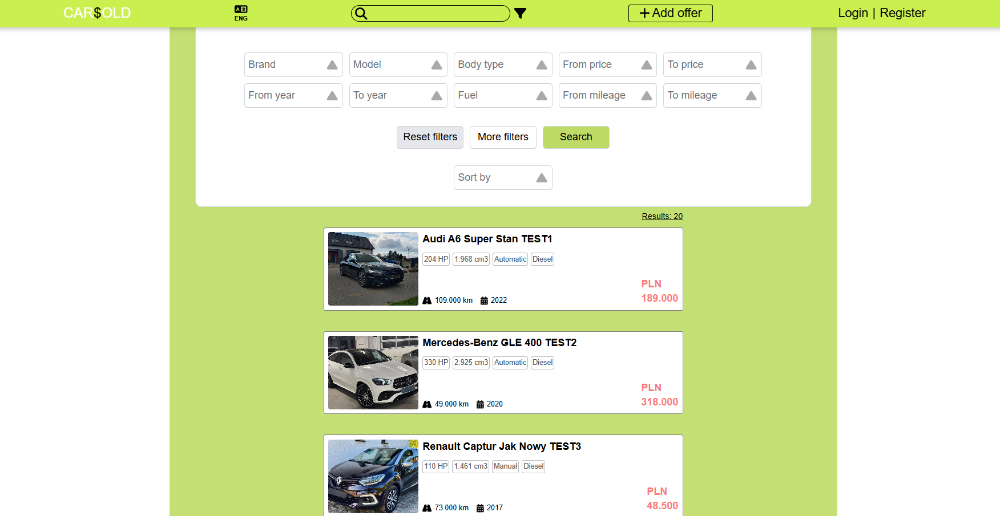
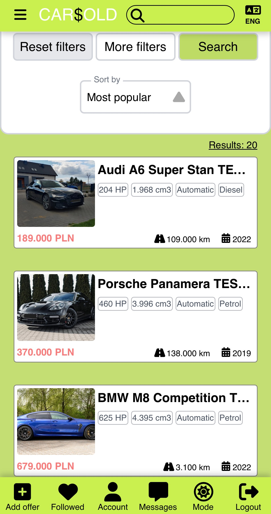
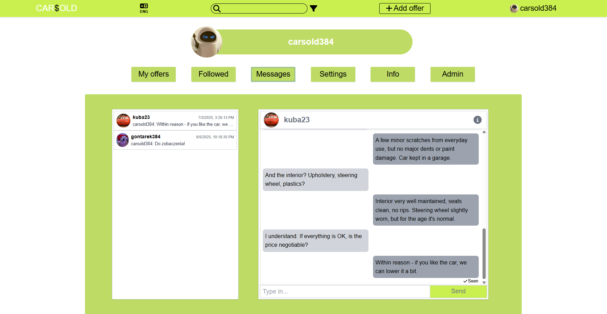
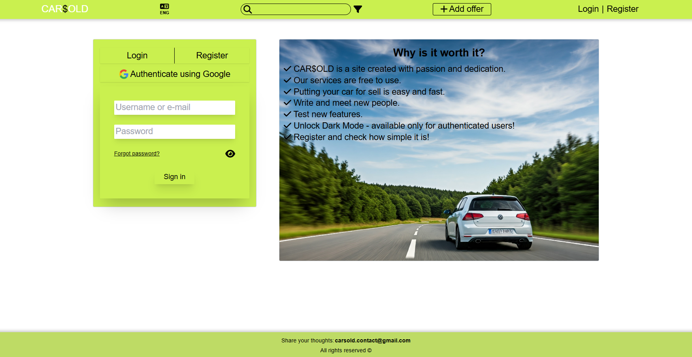
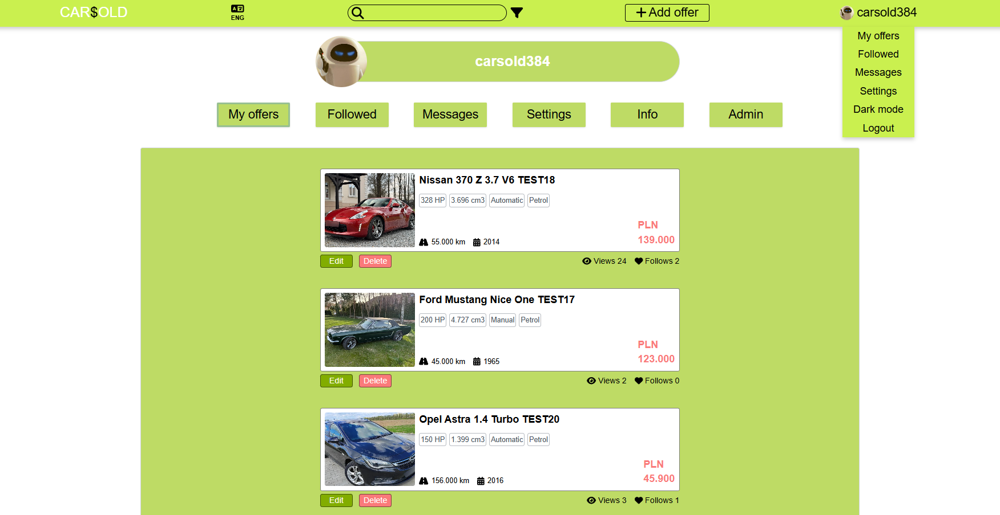

# Welcome car enthusiasts 💨🛞

## **CARSOLD** is car advertising portal available for everyone! It provides solid features and matches the most popular websites 🌐🚘

### Functionalities 🎈
- Search and filter offers 🔎
- Display offer: watch images, car info and user details 🖥️
- Add, edit, delete offers 🖋️
- Add offers to favourites ❤️
- Monitor own offers: check views and follows count 🔢
- Chat with other users (send messages, get notifications, delete and block) 💬
- Report offer ❗
- Change language: Polish & English 🌍
- Register with e-mail confirmation (or with Google) ®️
- Authenticate and authorize: with login (username/e-mail) and password or with Google 👀
- Password recovery via e-mail 📩
- Change user contact details and profile picture 🙋‍♂️
- Change password, delete account ❌
- Admin: see report, verify and delete offer or user account 🚦
- Full responsiveness: works perfectly on every device 📱

<br>

<p align="center">
  
  
</p>
<p align="center">
  
  
</p>
<p align="center">
  
  
</p>

<br>

## TECH STACK (Fullstack App):
- ✅ **Java 22, SpringBoot 3.4.1 (Maven)** - *Backend*
- ✅ **Node.js 22.17.1, TypeScript 5.8.3, React 18.3.1 with Vite** - *Frontend*
- ✅ **PostgreSQL 17.5** - *Database*
- ✅ **Tailwind** - *Styling (0 Prebuilt UI Components)*
- ✅ **Spring Security:**
    - Stateless **JWT** authentication
    - **HttpOnly Cookies** - *Secured, Lax*
    - CSRF disabled (not required for HttpOnly cookie based JWT)
    - CORS
    - OAuth2 custom handlers
- ✅ **Google Cloud Project (GCP):**
    - **Storage** - *stores images, accessed with signed URLs*
    - Cloud Vision API - *verifies images for inappropriate content*
    - Cloud Natural Language API - *verifies phrases & text for inappropriate content*
    - Places API (New) - *verifies and suggests locations*
    - Maps JavaScript API - *displays maps*
    - **OAuth2** - *Google Client for auth*
- ✅ **SMTP** - *sends e-mails*
- ✅ **WebSocket** - *enables sending and retrieving messages (chatting)*
- ✅ **nsfwjs, libphonenumber** - *verifies data*
- ✅ **Docker** - *deployment*

**The application puts great emphasis on data validation and user safety 🙏**

<br>

## CAR$OLD should be available at: [carsold.pl](https://carsold.pl) 🛜
## You can also check it out on YouTube: [YouTube](https://www.youtube.com/watch?v=rXg3ulcCdlM) 🎥

<br>

## **Installation / Configuration 🔧**

1) **Clone repository**
   - IntelliJ recommended
   - Java 22
   - Node.js 22.17.1
3) **Prepare GCP**
   - **OAuth2 Client**
       - Authorized JavaScript origins: `http://localhost:5173`
       - Authorized redirect URIs: `http://localhost:8080/login/oauth2/code/google`
       - Non-sensitive scopes: `./auth/userinfo.email, ./auth/userinfo.profile, openid`
       - Save **Client ID and Client Secret**
   - **Storage**
       - Create bucket with **specified name**
       - Public Access: Not public - prevent hotlinking and keep safe-billing
       - Access control: Uniform
       - CORS `origin: ["http://localhost:5173"], "responseHeader": ["Content-Type"], "method": ["GET", "HEAD", "OPTIONS"], "maxAgeSeconds": 3600`
       - Create Service Account and set role on bucket: Storage Object Admin
       - Generate and save cloud-storage-key.json for Service Account, then put it in /resources
   - **Cloud Vision API**
       - Enable API
       - set quotas to keep safe-billing
   - **Cloud Natural Language API**
       - Enable API and generate restricted API key
       - set quotas to keep safe-billing
   - **Places API (New)**
       - Enable API and generate restricted API key
       - set quotas to keep safe-billing
   - **Maps JavaScript API**
       - Enable API and generate restricted API key (restrict additionally to Web application: `http://localhost:5173`)
       - set quotas to keep safe-billing
4) **Prepare SQL Database (PostgreSQL recommended)**
5) **Prepare JWT Secret Key: run `head -c 32 /dev/urandom | base64` in bash**
6) **Prepare e-mail and password for SMTP (Gmail recommended)**
7) **Create .env file in root and fill with prepared values as shown. Then put path to .env in app run configuration**
    ```
    #Cookies secured when = production
    ENVIRONMENT=deployment
    
    #Database
    DATASOURCE_URL=
    DATASOURCE_USER=
    DATASOURCE_PASSWORD=
    
    FRONTEND_URL=http://localhost:5173
    
    #JWT cookie expiration time
    SESSION_TIME=168
    
    JWT_SECRET_KEY=
    
    #SMTP
    EMAIL=
    EMAIL_PASSWORD=
    
    #OAuth2 - Google
    GOOGLE_ID=
    GOOGLE_SECRET=
    
    #Google Cloud Storage and Cloud Vision - cloud-storage-key.json absolute path
    GOOGLE_APPLICATION_CREDENTIALS=
    GOOGLE_CLOUD_PROJECT=
    GOOGLE_CLOUD_BUCKET_NAME=
    
    CLOUD_NATURAL_LANGUAGE_API_KEY=
    
    PLACES_API_KEY=
    ```
8) **Create .env file in /frontend and fill with prepared values**
    ```
    VITE_BACKEND_URL=http://localhost:8080
    VITE_MAPS_APIKEY=
    VITE_CONTACT_EMAIL=carsold.contact@gmail.com
    ```
9) **Run `mvn clean install` in root and `npm install` in /frontend**
10) **Start SpringBoot App and run `npm run dev` in /frontend**

<br>

## License
This project is licensed under a custom non-commercial license.
See the LICENSE file for details.
