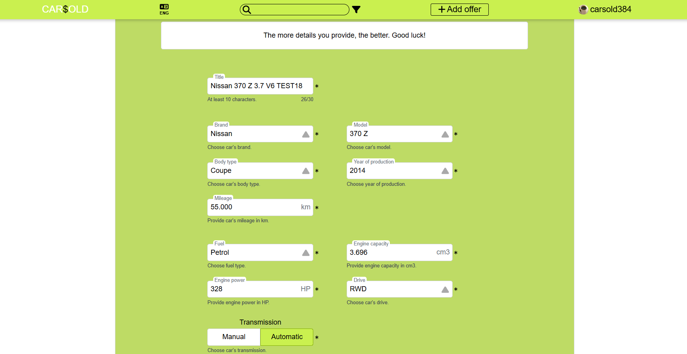
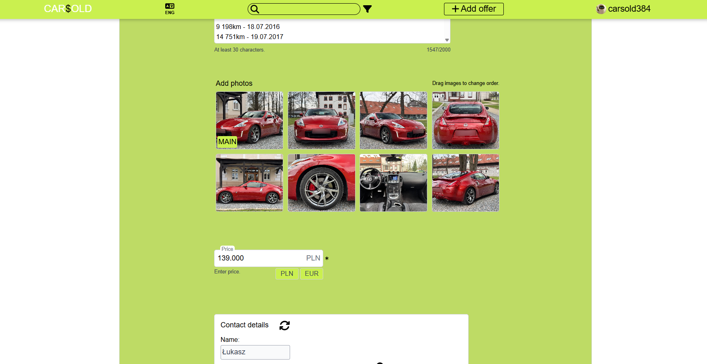

# Hello Car Enthusiasts ❗

**CARSOLD** is car advertising portal, build to be affordable for everyone 🚘
It's a full-stack web application built with Java (**Spring Boot**) and TypeScript (**React**).

### Currently should be available at: [carsold.pl](https://carsold.pl/search?page=0&size=10)
### You can also watch YT video: [YouTube](https://www.youtube.com/watch?v=rXg3ulcCdlM)
<br>


- Every component there is designed by myself since I didn't use any ready-to-use React libraries,
because I wanted to have full control and TRYHARD styling with Tailwind. That's why app desing
may not be so beautiful... 😜 But I tried my best and mainly focused on **business logic,
security and data validation**

- App uses SQL DB and it's highly related to GCP, since it uses its APIs and buckets to validate
and store data

- It's utterly responsive, have animated components, and UI/UX features. All working perfectly fine
on **💻 PC and 📱 mobile**

<p align="center">
  
</p>

## Functionality
 
### Unauthorized user features
- Search and sort offers using filters
- Display offer: watch images, car info and user contact details
- Change language: thanks to dictionary - Polish and English are available
<br>


### Authentication
- Registration (creating an account): user data validation by GCP APIs. Account confirmation
  by e-mail
- Authentication: login using e-mail or username
- OAuth2: user can authenticate via Google OAuth2
- Password recovery: forgotten password may be recovered by providing user's e-mail
<br>


### Authorized user features
- Add offer: fill required fields and add up to 8 images (stored in GCS buckets). All data is
  validated, especially images by AI (frontend - NSFW Model, backend - Google Cloud Vision)
- Edit, delete offer
- Change profile picture - same validation happens
- Change user contact details (validated by Places API, Natural Language API, libphonenumber)
- Change password, delete account
- Monitor own offers: check views and follows count
- Follow offers
- Report offers
- Write messages (fully functional chatting, based on WebSocket communication protocol).
  Includes retrieving notifications, blocking users, deleting chats
- Admin sees reports and may delete inappropriate offers or users
<br>






### Secure data management
- All incoming data is always checked initially in frontend and then validated on backend using
  stack of GCP technologies
- Reporting mechanism: user is able to report inappropriate offers, so then admin can verify react
- Images held in GCS buckets
- Fully normalized Database
- Pagination
- Optimized to work fast and without bugs & errors

### User account security
- App is stateless: no server-side sessions and no CSRF token
- Auth based on JWT, stored in HttpOnly cookie to prevent XSS
- CORS and Cookies properly configured to mitigate CSRF risks
- OAuth2 login implemented with custom handlers
- All secured data like keys provided in .env files
- Passwords stored hashed

### REST
- CRUD followed
- DTOs for data transfer
- Stateless
- Error/exception logging thanks to error handlers
- Anti-spam mechanisms and is optimized for performance and efficiency

### Tests
The project includes unit tests for the frontend (Jest) and both unit and integration tests for the
backend (Mockito and SpringBootTest)

### Deployment
The application is currently deployed on **Render** for the backend (Dockerized), **Netlify** for 
the frontend (static build), and **Neon** for the database, using GCP for features

## Running locally
If you want to run CAR$OLD locally, you should clone my repo. I recommend to use InteliiJ. It would 
work properly with Java 22 and Node 22.11.0

- ```npm install``` in frontend
- Install Maven dependencies
- Create key for JWT creation: Base64-encoded byte array format - run ```head -c 32 /dev/urandom | base64``` in bash to generate
- Provide e-mail for SMTP (gmail recommended) and password (App passwords)
- SQL Database (PostgreSQL recommended) with its URL, user and password
- GCP with properly configured services:
1) OAuth2 with: Authorized JavaScript origins: `http://localhost:5173` and Authorized redirect URIs:
   `http://localhost:8080/login/oauth2/code/google`. Non-sensitive scopes set like: ./auth/userinfo.email,
   ./auth/userinfo.profile, openid. Then you need Client ID and Client Secret
2) Create GCP service account and then bucket with such settings:
   CORS: origin: ["*"], "responseHeader": ["Content-Type"], "method": ["GET", "HEAD", "OPTIONS"], 
   "maxAgeSeconds": 3600. Then get key from service account in .json file, which you should put in app resources
3) Cloud Vision enabled
4) Perspective Comment Analyser API access (to be granted on their page) and then API key
5) Cloud Natural Language API key
8) Places (New) API key
9) Maps JavaScript API key

### You'll need two .env files - for frontend and backend, filled with generated keys and resources:

root (backend)

```
#Cookie(Secured): true
DEPLOYMENT=false

DATASOURCE_URL=
DATASOURCE_USER=
DATASOURCE_PASSWORD=

FRONTEND_URL=http://localhost:5173

#JWT cookie expiration time
SESSION_TIME=168

JWT_SECRET_KEY=

#SMTP
EMAIL=
EMAIL_PASSWORD=

#OAuth2-Google
GOOGLE_ID=
GOOGLE_SECRET=

#Google Cloud Storage Service Account JsonKey Absolute Path
GOOGLE_APPLICATION_CREDENTIALS=

GOOGLE_CLOUD_PROJECT=
GOOGLE_CLOUD_BUCKET_NAME=

PERSPECTIVE_API_KEY=

CLOUD_NATURAL_LANGUAGE_API_KEY=

PLACES_API_KEY=
```
Then you must put path to .env file in app run configuration.

/frontend

```
VITE_BACKEND_URL=http://localhost:8080
VITE_MAPS_APIKEY=
VITE_CONTACT_EMAIL=carsold.contact@gmail.com
```

Then run ```npm run dev``` in /frontend and start Spring Boot.

The project includes a Dockerfile used for containerizing the backend (Spring Boot), primarily used for deploying the application

## CAR$OLD App is developed and owned solely by myself
Commercial use, redistribution, or representation of this application under any individual, group, or organization is strictly 
not permitted. You are welcome to view and explore the app in a non-commercial, read-only capacity.
All rights to manage, modify, distribute, or license CAR$OLD App are fully reserved by the author.
